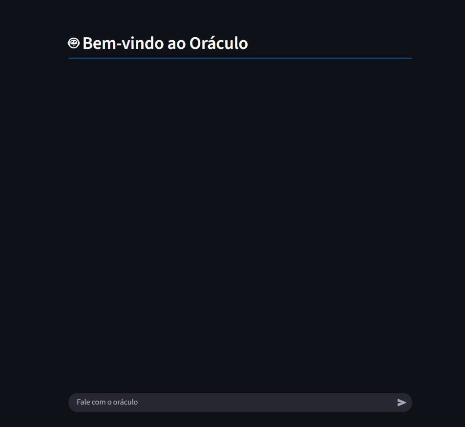
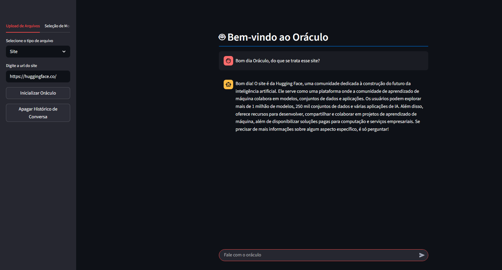
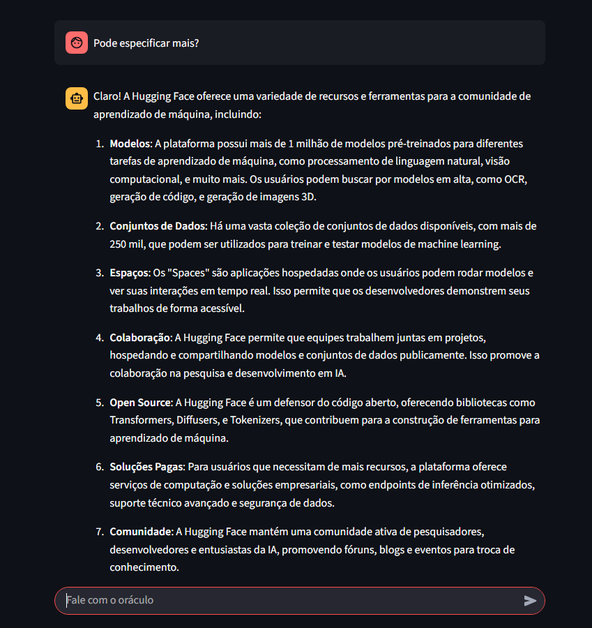

# Oráculo — Assistente Inteligente com Upload de Arquivos

Este projeto é um aplicativo de chatbot em [Streamlit](https://streamlit.io/) que permite ao usuário conversar com grandes modelos de linguagem (LLMs) como OpenAI GPT e Groq Llama, fornecendo contexto personalizado extraído de **arquivos**, **sites** ou **vídeos do YouTube** enviados pelo próprio usuário.

---

## Demonstração





---

## Funcionalidades

- **Upload de múltiplos tipos de arquivos**: PDF, CSV, TXT, links de sites e vídeos do YouTube.
- **Suporte a múltiplos provedores/modelos**: Groq (Llama, Gemma, Mixtral) e OpenAI (GPT-4o, O1).
- **Chat com memória de contexto**: O histórico da conversa é mantido para respostas mais naturais e contextualizadas.
- **Interface amigável**: Totalmente baseada em Streamlit, com abas e chat interativo.
- **Customização fácil**: Adicione sua própria chave de API para diferentes provedores.
- **Limpeza do histórico de conversa** com um clique.

---

## Instalação

1. **Clone este repositório:**
   ```bash
   git clone https://github.com/yagosamu/projeto-oraculo.git
   cd projeto-oraculo
   ```

2. **(Opcional) Crie um ambiente virtual:**
   ```bash
   python -m venv venv
   # Linux/Mac:
   source venv/bin/activate
   # Windows:
   venv\Scripts\activate
   ```

3. **Instale as dependências:**
   ```bash
   pip install -r requirements.txt
   ```

---

## Como executar

```bash
streamlit run app.py
```

O aplicativo será aberto no navegador, geralmente em [http://localhost:8501](http://localhost:8501).

---

## Estrutura do Projeto

```
.
├── app.py                 # Arquivo principal do Streamlit
├── loaders.py             # Funções utilitárias para diferentes tipos de arquivos
├── requirements.txt       # Dependências do projeto
├── images/                # Imagens/prints do app (opcional)
│   ├── screenshot1.png
│   ├── screenshot2.png
│   └── screenshot3.png
└── README.md
```

---

## Requisitos

- Python 3.8+
- Chave de API válida para OpenAI e/ou Groq
- Internet para acesso aos modelos e carregamento de conteúdos externos

---

## Créditos

- **Desenvolvimento:** Yago Lopes (yagosamu)
- **Frameworks:** [Streamlit](https://streamlit.io/), [Langchain](https://www.langchain.com/), [OpenAI](https://openai.com/), [Groq](https://groq.com/)

---

## Licença

Este projeto é distribuído **sem licença explícita**. Sinta-se à vontade para estudar e adaptar para uso pessoal ou acadêmico, mas consulte o autor para usos comerciais.
